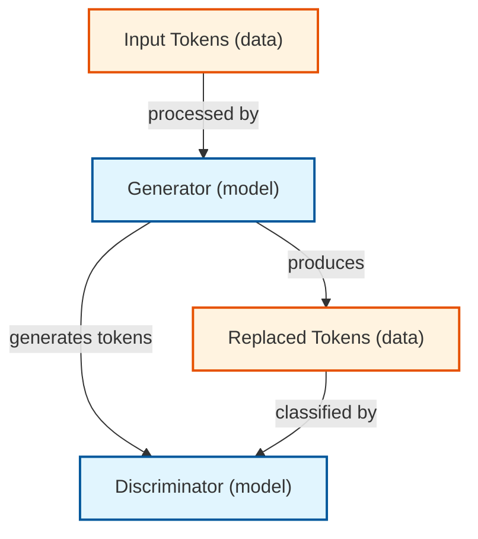

# Paper Visualizer

NLP 논문(특히 ELECTRA 같은 Transformer 기반 모델)의 핵심 방법론을 자동으로 분석하여 Mermaid 다이어그램이 포함된 마크다운 리포트를 생성하는 CLI 도구입니다.

## 기능

- PDF 논문에서 텍스트 추출
- PydanticAI를 사용한 LLM 기반 방법론 분석
- Mermaid 다이어그램 자동 생성
- 마크다운 형식의 상세 리포트
- 기존 방법과의 비교 다이어그램

## 설치

```bash
# 프로젝트 클론
git clone <repository-url>
cd paper-visualizer

# uv로 의존성 설치
uv sync

# 개발 의존성 포함 설치
uv sync --dev
```

## 사용법

### 1. 환경 변수 설정

```bash
export OPENAI_API_KEY=your_api_key_here
```

### 2. 단일 논문 분석

```bash
uv run paper-visualizer --input examples/paper.pdf --output output
```

### 3. 다양한 출력 형식

```bash
# 마크다운 리포트만
uv run paper-visualizer -i paper.pdf -f markdown

# Mermaid 다이어그램만
uv run paper-visualizer -i paper.pdf -f mermaid

# 둘 다 생성 (기본값)
uv run paper-visualizer -i paper.pdf -f both
```

### 4. 상세 출력

```bash
uv run paper-visualizer -i paper.pdf --verbose
```

## 프로젝트 구조

```
paper-visualizer/
├── src/
│   ├── __init__.py
│   ├── models.py           # Pydantic 모델 정의
│   ├── pdf_parser.py       # PDF 텍스트 추출
│   ├── analyzer.py         # PydanticAI 기반 논문 분석
│   ├── visualizer.py       # Mermaid 코드 생성
│   └── main.py             # 메인 실행 파일
├── tests/
│   └── test_*.py
├── examples/
│   └── paper.pdf
├── output/                 # 생성된 리포트 저장
├── pyproject.toml
└── pyrightconfig.json
```

## 개발

### 타입 체크

```bash
uv run basedpyright src/
```

### 테스트 실행

```bash
uv run pytest
```

### 코드 포맷팅

```bash
uv run black src/
uv run ruff check src/
```

## 예제 출력

### 생성된 Mermaid 다이어그램 예시



## 지원하는 논문 유형

- Transformer 기반 모델 (BERT, GPT, T5 등)
- Generator-Discriminator 구조 (ELECTRA 등)
- Encoder-Decoder 아키텍처
- Pre-training/Fine-tuning 접근법

## 요구사항

- Python 3.11+
- OpenAI API 키
- PyMuPDF (PDF 파싱)

## 라이선스

MIT License